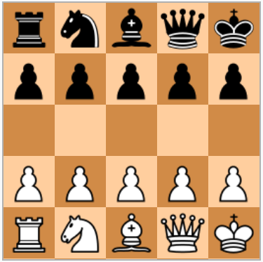

# Minichess AI

This is a Minichess artificial intelligence based on the T-Rex evolutionary neural network. It trains playing the game against itself without any prior knowledge except the rules of the game. During training, the winners are stored in a list, so each new winner must win not only the current winner but also the previous ones. After completing the training, the program plays against you through a basic text interface.



## Game information

Minichess is a family of chess variants played with regular chess pieces and standard rules, but on a smaller board. The motivation for these variants is to make the game simpler and shorter than the standard chess. The first chess-like game implemented on a computer was a 6×6 chess variant Los Alamos chess. The low memory capacity of the early days computer required reduced board size and smaller number of pieces to make the game implementable on a computer.

A board needs to be five squares wide to contain all kinds of chess pieces on the first row. In 1969, Martin Gardner suggested a chess variant on 5×5 board in which all chess moves, including pawn double-move, en-passant capture as well as castling can be made. Later AISE (Associazione Italiana Scacchi Eterodossi, "Italian Heterodox Chess Association") abandoned pawn double-move and castling.

### Naming the pieces

Each piece type is identified by an uppercase letter:

| Piece  | White | Black |
| ------ | ----- | ----- |
| Tower  |   T   |  ..T  |
| Knight |   K   |  ..K  |
| Bishop |   B   |  ..B  |
| Queen  |   Q   |  ..Q  |
| King   |   L   |  ..L  |
| Pawn   |   P   |  ..P  |

### Notation for moves

Each move of a piece is indicated by the piece's source column, source row, target column and target row separated by a blank space. For example, to move the first pawn on the left one square up, the move is: 

```
0 1 0 2
```

## Neural network information

T-Rex is an evolutionary neural network. It learns by adjusting the strength of the connection weights by mutation and selection. The programmer must define the problem to solve with a scoring system so that T-Rex can evolve gradually until finding the optimal solution.

Main features:

- Binary feedforward neural network
- Configurable number of inputs, hidden layers and outputs
- Developed using object-oriented programming
- Fast, robust and portable

### Input layer

The input layer receives the status of the player's pieces and then the opponent's pieces. For a 5 x 5 board there are 5 inputs per piece. Since there are 10 pieces per player and there are 2 players, the total number of inputs is 100. 

### Hidden layers

The neural network has 100 hidden layers. The T-Rex architecture states that the number of neurons in each hidden layer is set as the number of input neurons so they have 100 neurons.

### Output layer

The output layer provides the code of the piece that moves and its new position. For a 5 x 5 board there are 4 outputs for the code of the piece and 5 for its new position. The total number of outputs is 9.

## Installing dependencies

You must compile T-Rex as a shared library:

https://github.com/Kenshiro-28/T-Rex

Copy the generated file **libT-Rex.so** in the folder /usr/local/lib

Copy the header files in the folder /usr/local/include/T-Rex

``` 
T-Rex
   ├── data_tier
   │   └── DataManager.h
   ├── logic_tier
   │   ├── NeuralLayer.h
   │   └── NeuralNetwork.h
   └── presentation_tier
       └── ConsoleManager.h
```

## Building

Run this command to build the program:

```
$ make
```

## Running

Run this command to start the program:

```
$ ./Minichess
```

This project includes a trained neural network. Running the program will skip the training phase if there is a neural network file in the same folder. To train a new neural network, delete the file **neural_network.json**.

## Cleaning

Run this command to delete the generated files:

```
$ make clean
```

----- Work in progress -----
