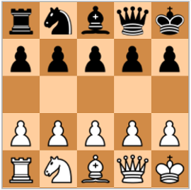

# Minichess

This is a Minichess artificial intelligence based on the T-Rex evolutionary neural network. It trains playing the game against itself without any prior knowledge except the rules of the game. During training, the winners are stored in a list, so each new winner must win not only the current winner but also the previous ones. After completing the training, the program plays against you through a basic text interface.



## Game information

Minichess is a family of chess variants played with regular chess pieces and standard rules, but on a smaller board. The motivation for these variants is to make the game simpler and shorter than the standard chess. The first chess-like game implemented on a computer was a 6×6 chess variant Los Alamos chess. The low memory capacity of the early days computer required reduced board size and smaller number of pieces to make the game implementable on a computer.

A board needs to be five squares wide to contain all kinds of chess pieces on the first row. In 1969, Martin Gardner suggested a chess variant on 5×5 board in which all chess moves, including pawn double-move, en-passant capture as well as castling can be made. Later AISE (Associazione Italiana Scacchi Eterodossi, "Italian Heterodox Chess Association") abandoned pawn double-move and castling.

## Installing dependencies

You must compile T-Rex as a shared library:

https://github.com/Kenshiro-28/T-Rex

Copy the generated file **libT-Rex.so** in the folder /usr/local/lib

Copy the header files in /usr/local/include in a folder named T-Rex:

``` 
T-Rex
   ├── data_tier
   │   └── DataManager.h
   ├── logic_tier
   │   ├── NeuralLayer.h
   │   └── NeuralNetwork.h
   └── presentation_tier
       └── ConsoleManager.h
```

## Building

Run this command to build the program:

```
$ make
```

## Running

Run this command to start the program:

```
$ ./Minichess
```

## Cleaning

Run this command to delete the generated files:

```
$ make clean
```

----- Work in progress -----
